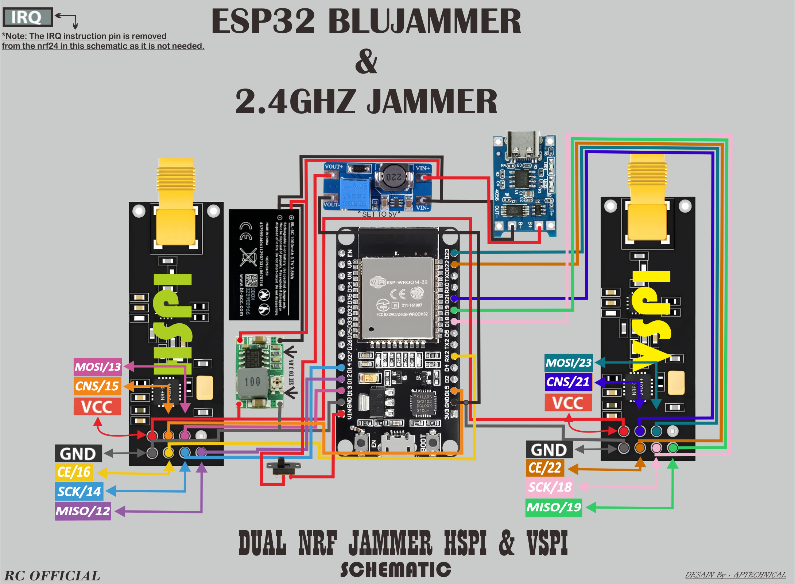

# 📡 APTECH FIRMWARE (BLUEJAMMER) - Pentest Tools 🔥

> 🚨 **PERHATIAN:**  
> Firmware ini ditujukan untuk **eksperimen edukasi dan pentest** jaringan pribadi. Dilarang digunakan untuk merusak sistem orang lain tanpa izin.

---

## 📥 Download Firmware

- 🔗 [Klik di sini untuk download .bin](./bluejammer.bin)
- Ukuran: ±512KB
- Versi: 1.0.0
- Platform: ESP32 / ESP32U / ESP32s
- Flash manual di esp8266 flasher atau esptool

---

## 🔍 Fungsi & Kegunaan

🛠️ **BlueJammer** adalah firmware pentest untuk pengujian kekuatan sinyal & reaksi perangkat terhadap gangguan jaringan. Dapat digunakan untuk:

- Simulasi serangan wireless
- Uji kekuatan NRF24 terhadap interferensi
- Eksperimen IOT jammer (legal di ruang lab)

---

## 🧰 Daftar Komponen

| Komponen         | Jumlah | Keterangan                          |
|------------------|--------|-------------------------------------|
| 🔌 ESP32U / ESP32S | 1x     | Sebagai otak utama (pengontrol)     |
| 📡 NRF24L01       | 2x     | Modul komunikasi 2.4GHz             |
| 🔋 Baterai BL-5C   | 1x     | Baterai utama                        |
| ⬇️ Step Down      | 1x     | Menyesuaikan voltase ke 3.3V        |
| ⬆️ Step Up        | 1x     | Boost voltase dari 3.7 ke 5V jika perlu |
| 🧯 Elco 100uF 10V  | 2x     | Dipasang di VCC & GND tiap NRF24    |
| 🪫 Charger TP4056  | 1x     |
Di Gunakan di Jalur Input Daya Baterai 3.7v untuk men charger baterai 1000mah

---

## 🔌 Pemasangan Komponen

🔧 Hubungkan komponen sesuai skema di atas.  
📷 Pastikan posisi elco benar (polaritas), agar modul NRF24 tidak drop.  
💡 Gunakan kabel pendek agar sinyal stabil & tidak ada delay.

---

## 📢 Himbauan Penting

❗ Jangan gunakan alat ini di area publik atau jaringan milik orang lain.  
✅ Disarankan digunakan hanya di mode **offline testing**.  
📚 Pelajari dan gunakan dengan tanggung jawab, seperti **Nethercap** atau tools pentest profesional lain.

---

## 🧪 Testing

- Sudah diuji menggunakan ESP32 Devkit & NRF24 asli
- Daya tahan baterai BL5C sekitar 2–4 jam pemakaian
- Firmware ringan, hanya memakan ~20% dari total flash

---

## 🚀 Flashing Firmware via WebFlasher

🌐 **Gunakan WebFlasher tercepat untuk instalasi firmware langsung dari browser.**  
⚠️ **Pastikan tekan tombol `BOOT` di board ESP saat proses flashing!**  
Pilih firmware `.bin` yang sesuai lalu ikuti petunjuk di layar.

🔧 WebFlasher ini sangat praktis dan cocok buat pemula:  
- Nggak perlu install aplikasi tambahan  
- Bisa langsung jalan di Chrome / Edge  
- Aman dan cepat untuk flashing firmware
- Harap gunakan pc atau laptop yang dapat mendeteksi com/port untuk flash lewat webflasher

📎 Link WebFlasher akan disediakan nanti di halaman ini.  
📌 link webflasher (https://smoochiee.github.io/Bluetooth-jammer-esp32/flash1):  
`Pilih opsi : (Dual Nrf24l01 Vspi and Hspi pins) untuk flash lebih flexible`

💻 Jika tombol ditekan, akan langsung diarahkan ke halaman flashing otomatis!

---

❓ Butuh bantuan saat flashing? Gabung komunitas Telegram untuk diskusi dan troubleshooting!

## 🤝 Credits

- Dibuat oleh: **ARYA25**
- dukungan : *RC-PROJECT*
- Dibantu AI: ChatGPT,Gemini Pro
- Terinspirasi dari: Nethercap, Deauther, & ESP32 Tools

---

## 💬 Kontak

📧 Telegram (https://t.me/RClCOMUNITYIOFFICIAL)  
💻 [GitHub ARYA25](https://github.com/...) *(dumy)*
